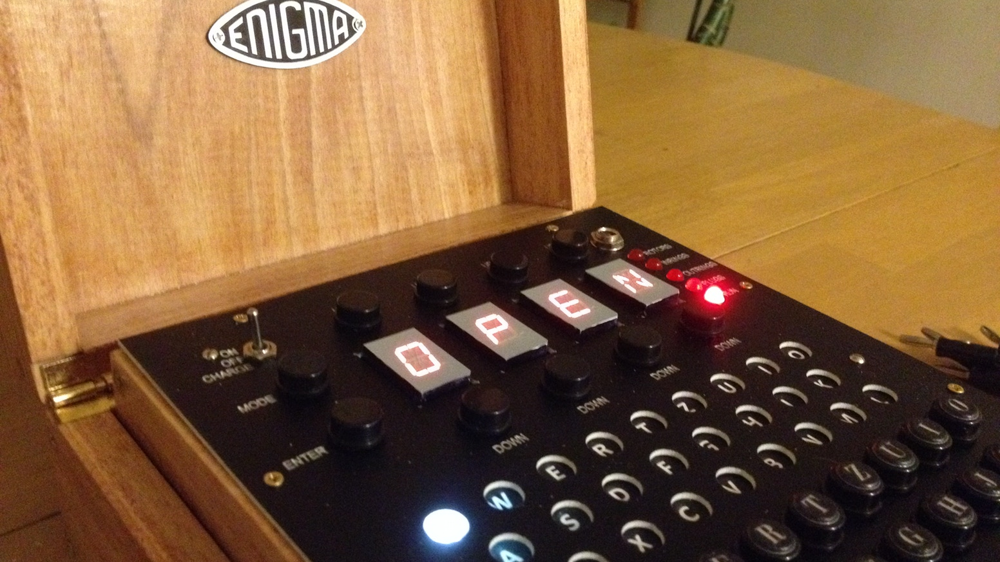

# Open Enigma

This repository contains the Arduino code for the [S&T GeoTronics Enigma Mark 4 IP Kit Plugged](https://www.stgeotronics.com/Enigma-Mark-4-IP-Kit-Plugged-KIT-Enigma-Plugged.htm). The modified code for the S&T GeoTronics Enigma Mark 4 in this repository emulates the [Enigma M3](https://www.cryptomuseum.com/crypto/enigma/wiring.htm#5), [Enigma M4](https://www.cryptomuseum.com/crypto/enigma/wiring.htm#6) (including [double stepping](http://www.intelligenia.org/downloads/rotors1.pdf)) and the [Norenigma](https://www.cryptomuseum.com/crypto/enigma/wiring.htm#3).

## Installation Instructions

Download the [Arduino source code for S&T GeoTronics Enigma Mark 4 IP Kit Plugged](Open_Enigma_M4_Plugboard/Open_Enigma_M4_Plugboard.ino). Connect your S&T GeoTronics Enigma Mark 4 to your computer via USB, and upload the code to the Arduino Mega using the 
[Arduino IDE](https://www.arduino.cc/en/Main/Software).

## Operation Instructions

To understand how to operate the S&T GeoTronics M4 Enigma, please refer to the following guide:

 - **[BJ Gleason - Open Enigma for Dummies](docs/BJ%20Gleason%20-%20Open%20Enigma%20for%20Dummies.pdf)**

The source code for the S&T GeoTronics Enigma Mark 4 IP Kit Plugged has been modified to 
output debug info over serial communication (via USB). It can also be set to emulate the 
Enigma M3 and Norenigma. 

To switch between Enigma M4, M4 double stepping, M3 and Norenigma mode, 
use the upper left function key. See the source code for additional documentation.

## Release Notes

 - Designed, assembled & programmed by Marc Tessier & James Sanderson 2013-09-20
 - Modified for Prototype PCB pair on 2013-12-04
 - Modified to obey doublesteping and have M3 function 2014-03-22
 - Code formatting, cleanup and documentation, serial output - bitjungle 2019-01-06
 - Norenigma emulation - bitjungle 2019-01-26
